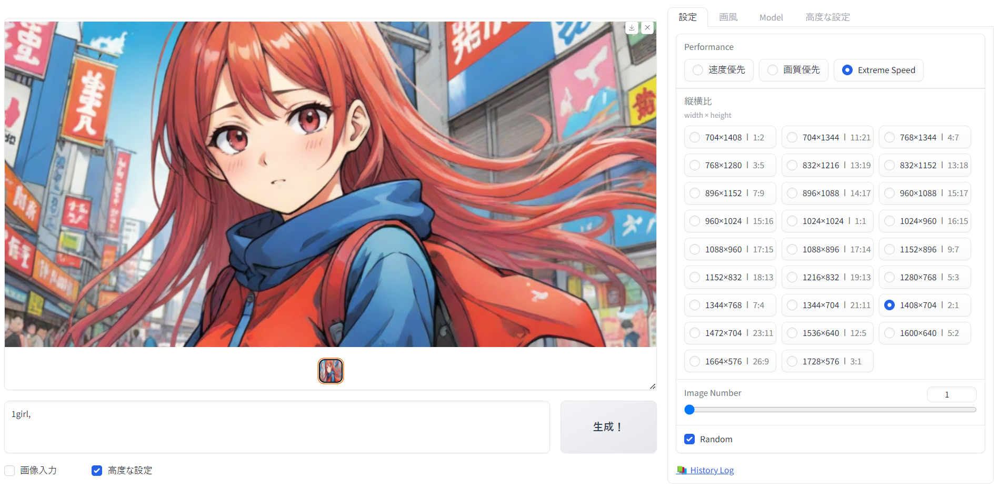
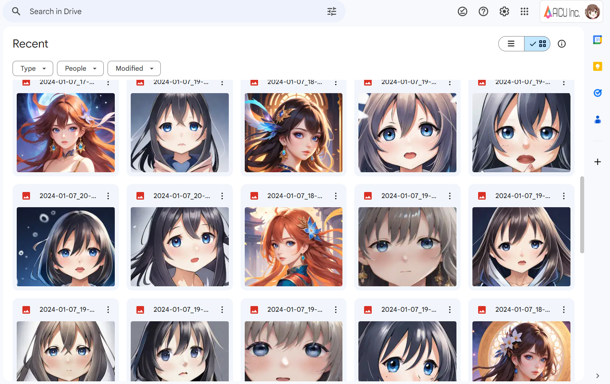

# Artist-Guide-for-SDXL

ここはAICUのコミュニティおよび商業出版を予定している書籍の開発を行うリポジトリです。

news [画像生成AI　Stable Diffusion スタートガイド](https://j.aicu.ai/SBXL) として発売されます！

詳細は[こちら](https://corp.aicu.ai/ja/sbxl)

書籍のサポートリポジトリは[こちら](https://github.com/aicuai/Book-StartGuideSDXL)です

https://github.com/aicuai/Book-StartGuideSDXL

## Fooocus 日本語アニメ特化版

- いちおう無料版 Google Colab で動きます

## [AUTOMATIC1111/Stable Diffusion Web UI on Colab](https://github.com/aicuai/Artist-Guide-for-SDXL/blob/main/AICU_fast_stable_diffusion_AUTOMATIC1111.ipynb)

- まだまだ開発中。
- Google Colab Pro 必須

